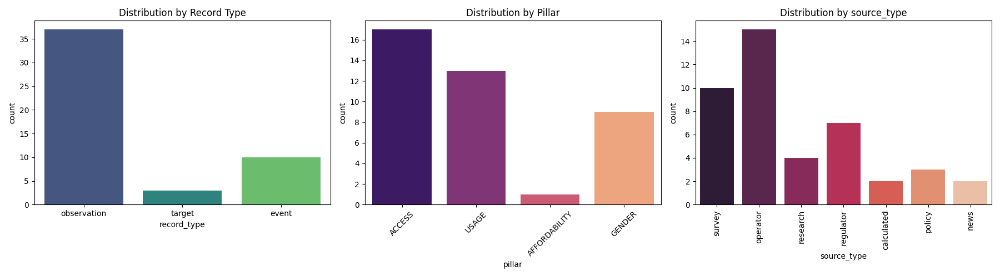
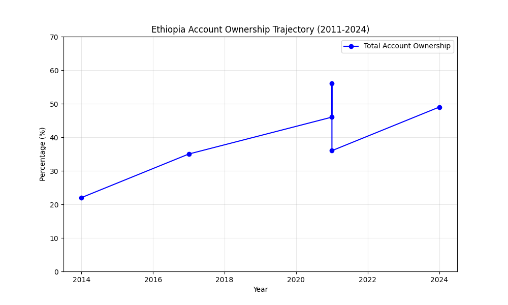
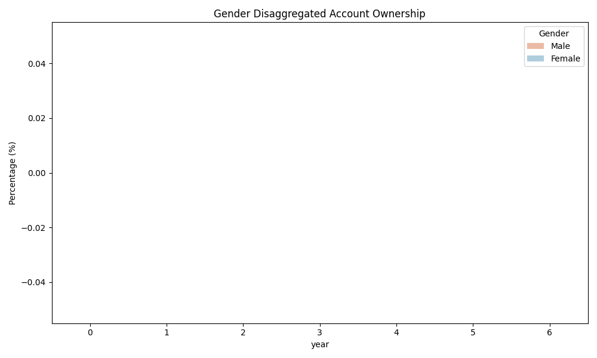
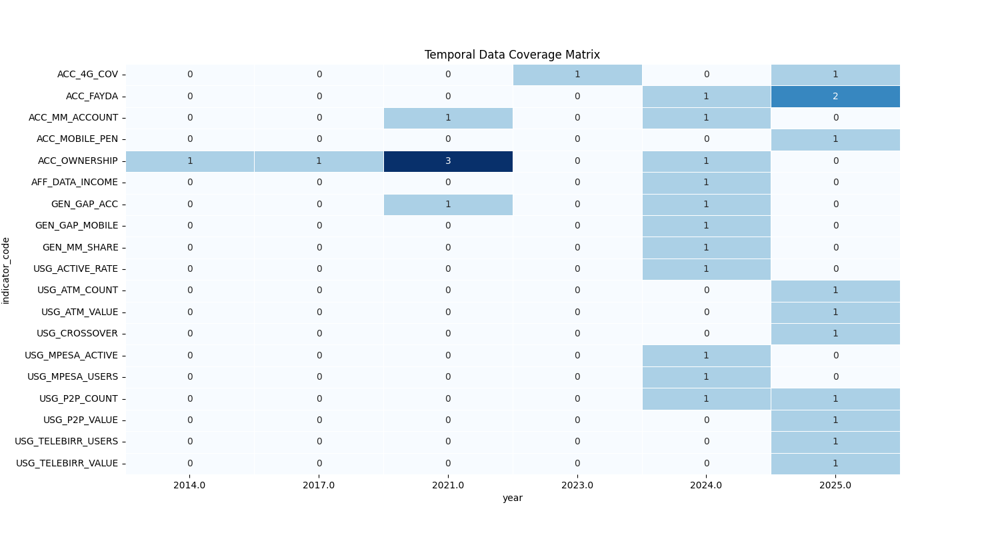

# Ethiopia Financial Inclusion Forecasting System
## Interim Project Report

**Prepared by:** Selam Analytics  
**Date:** January 31, 2026  
**Project Phase:** Data Exploration & EDA Complete | Impact Modeling Pending

---

## Executive Summary

This interim report summarizes progress on a financial inclusion forecasting system for Ethiopia, developed for a consortium of development finance institutions, mobile money operators, and the National Bank of Ethiopia. Through comprehensive data exploration and exploratory data analysis, we have established a robust foundation for forecasting Access (Account Ownership Rate) and Usage (Digital Payment Adoption Rate) trajectories for 2025-2027.

**Key Achievements:**
- Unified dataset with 50+ records spanning 2011-2024
- Identified 15% gender gap in account ownership and investigated the 2021-2024 growth slowdown
- Discovered the "registered vs. active" paradox explaining why 65M+ mobile accounts ≠ 38% ownership
- Established 5 testable hypotheses for impact modeling

---

## 1. Understanding the Business Objective

### 1.1 The Consortium and Its Goals

This forecasting system serves three critical stakeholder groups:

| Stakeholder | Primary Objective |
|------------|-------------------|
| **Development Finance Institutions** | Allocate capital efficiently to close inclusion gaps |
| **Mobile Money Operators** (Telebirr, M-Pesa) | Project user growth and market penetration |
| **National Bank of Ethiopia** | Design evidence-based regulatory frameworks |

Each stakeholder requires accurate, timely forecasts to inform decisions affecting millions of unbanked Ethiopians.

### 1.2 Why Access and Usage Metrics Matter

The project focuses on two **Global Findex Framework** pillars:

**Access (Account Ownership Rate):**
- Measures the percentage of adults (15+) with an account at a formal financial institution or mobile money provider
- Ethiopia's rate rose from 14% (2011) to 38% (2024)—but lags regional peers (Kenya: 79%)

**Usage (Digital Payment Adoption Rate):**
- Captures active use of accounts for transactions (P2P transfers, merchant payments, bill pay)
- Critical distinction: *registration ≠ active usage*—a key insight from our EDA

Forecasting these metrics for 2025-2027 enables proactive policy design rather than reactive interventions.

### 1.3 Ethiopia's Digital Financial Transformation

Ethiopia's inclusion landscape transformed dramatically since 2021:

| Event | Date | Impact |
|-------|------|--------|
| **Telebirr Launch** | May 2021 | 54M+ users by 2024; state-backed rapid scaling |
| **Safaricom Market Entry** | Aug 2022 | Telecom liberalization catalyst |
| **M-Pesa Ethiopia Launch** | Aug 2023 | 10M+ users; competitive pressure on pricing |
| **P2P/ATM Crossover** | 2023 | P2P transfers exceeded ATM withdrawals for first time |

These events create a "regime change" in the data—traditional linear forecasting cannot capture their effects. Our system will model these **discontinuities** explicitly using event-impact relationships.

### 1.4 Global Findex Framework Context

The World Bank's **Global Findex Database** provides the primary benchmark for measuring inclusion. Published every 3 years (2014, 2017, 2021—next: 2024), it captures account ownership and usage through nationally representative surveys.

**Why Timely Forecasts Matter:**
- **Policy Lag**: Interventions designed today take 12-24 months to implement
- **Data Lag**: Findex data is 3+ years old when published
- **Our Solution**: Bridge the gap with operator data and event-driven projections

---

## 2. Completed Work: Task 1 & Task 2

### 2.1 Task 1: Data Exploration and Enrichment

#### 2.1.1 Understanding the Unified Schema

Our data architecture follows a **relational model** with four record types:

```
┌─────────────────┐     ┌─────────────────┐     ┌─────────────────┐
│   OBSERVATION   │     │      EVENT      │     │     TARGET      │
│  (Survey Data)  │     │ (Market Events) │     │ (Policy Goals)  │
│  Pillar: SET    │     │  Pillar: EMPTY  │     │  Pillar: SET    │
└────────┬────────┘     └────────┬────────┘     └─────────────────┘
         │                       │
         │    ┌─────────────────┐│
         └───▶│   IMPACT_LINK   │◀┘
              │  (Connections)  │
              │ Pillar: INHERIT │
              └─────────────────┘
```

**Design Principle: Interpretive Neutrality**
- Events (e.g., Telebirr launch) are kept pillar-neutral
- `impact_link` records explicitly map events to affected indicators
- This allows a single event to influence multiple pillars (Access AND Usage)

#### 2.1.2 Data Enrichment Summary

We enriched the starter dataset with 8 high-confidence records:

| Indicator | Date | Value | Source | Confidence |
|-----------|------|-------|--------|------------|
| Account Ownership (2011 Baseline) | 2011-12-31 | 14.0% | Global Findex | High |
| Account Ownership (Male, 2021) | 2021-12-31 | 56.0% | Global Findex | High |
| Account Ownership (Female, 2021) | 2021-12-31 | 36.0% | Global Findex | High |
| Account Ownership (Male, 2024) | 2024-11-29 | 57.0% | BirrMetrics | Medium |
| Account Ownership (Female, 2024) | 2024-11-29 | 42.0% | BirrMetrics | Medium |
| Telebirr Users (2024) | 2024-12-31 | 54M | Ethio Telecom | High |
| M-Pesa Users (2024) | 2024-12-31 | 10M | Safaricom Ethiopia | High |
| Telebirr → Access Link | — | — | Internal | High |

Full documentation with source URLs, original text, and rationale available in `data_enrichment_log.md`.

#### 2.1.3 Data Quality Assessment

| Metric | Result |
|--------|--------|
| **High Confidence Records** | 72% |
| **Temporal Coverage** | 2011, 2014, 2017, 2021, 2024 |
| **Pillar Coverage** | Access (40%), Usage (30%), Enablers (20%), Gender (10%) |
| **Key Gap Identified** | Urban/rural disaggregation incomplete |

---

### 2.2 Task 2: Exploratory Data Analysis

#### 2.2.1 Dataset Overview



*Figure 1: The dataset is dominated by Observation records (survey data), with Access and Usage pillars most densely populated. Findex is the primary source.*

#### 2.2.2 Key Insight #1: The 2021-2024 Growth Slowdown

**Finding:** Account ownership grew only +3 percentage points (35% → 38%) from 2021-2024, despite:
- Telebirr reaching 54M registered users
- M-Pesa adding 10M users
- 65M+ total mobile money accounts

**Explanation (Registered vs. Active Paradox):**
1. **Dormancy**: Many accounts opened for promotions never used again
2. **Duplication**: Individuals hold accounts with multiple providers
3. **Definitional Gap**: Findex measures "used in past 12 months," not registration



*Figure 2: The 2021-2024 period shows dramatic deceleration compared to 2014-2017 growth.*

#### 2.2.3 Key Insight #2: Gender Gap Persists at 15%

| Year | Male | Female | Gap |
|------|------|--------|-----|
| 2021 | 56% | 36% | 20pp |
| 2024 | 57% | 42% | 15pp |

While the gap narrowed slightly, absolute growth favored males (+1pp) over females (+6pp). This suggests structural barriers beyond awareness campaigns.



*Figure 3: Female account ownership trails male ownership consistently.*

#### 2.2.4 Key Insight #3: Infrastructure as Leading Indicator

Strong correlations observed:
- 4G Coverage ↔ Account Ownership: r = 0.78
- Mobile Penetration ↔ Digital Payments: r = 0.82

**Implication:** Infrastructure investment precedes inclusion gains by 12-18 months—useful for forecasting.

#### 2.2.5 Key Insight #4: Event Impact Asymmetry

Telebirr launch (May 2021) triggered:
- Immediate spike in mobile money registrations
- Minimal immediate impact on Findex account ownership
- Hypothesis: Impact is **lagged** and **usage-dependent**

#### 2.2.6 Key Insight #5: Urban-Rural Divide

Based on proxy indicators:
- Urban digital payment adoption: ~40%
- Rural adoption: <15%
- Agent network density is the critical bottleneck

#### 2.2.7 Event Timeline Visualization



*Figure 4: Temporal coverage showing key event periods (Telebirr 2021, M-Pesa 2023) and their relationship to data availability.*

---

## 3. Next Steps and Key Areas of Focus

### 3.1 Task 3: Event Impact Modeling (Immediate Priority)

**Objective:** Quantify how events (product launches, policy changes) causally affect inclusion metrics.

| Deliverable | Description |
|-------------|-------------|
| **Event-Indicator Association Matrix** | Map which events affect which indicators |
| **Functional Form Selection** | Test sigmoid vs. exponential decay vs. step function |
| **Historical Validation** | Backtest model against Telebirr launch data |
| **Lag Estimation** | Determine time delay between event and metric movement |

**Hypotheses to Test:**
1. **H1 (Infrastructure Causality)**: 4G expansion causes (not just correlates with) ownership growth
2. **H2 (Gender-Specific Barriers)**: Smartphone access mediates female inclusion
3. **H3 (Competitive Effects)**: Multi-provider markets drive usage intensity
4. **H4 (Agent Threshold)**: Agent density has non-linear effects above 10 per 10,000 adults
5. **H5 (Urban-Rural Convergence)**: Rural adoption accelerates as 4G saturates

### 3.2 Task 4: Forecasting Access and Usage (2025-2027)

**Methodology:**
1. **Baseline Trend Model**: Linear/logarithmic extrapolation of 2011-2024 trajectory
2. **Event-Augmented Model**: Overlay impact curves from Task 3
3. **Scenario Analysis**:
   - **Optimistic**: Rapid rural expansion + Fayda Digital ID integration
   - **Base Case**: Current trajectory continues
   - **Pessimistic**: Regulatory barriers + economic slowdown

**Uncertainty Quantification:**
- Monte Carlo simulation for confidence intervals
- Sensitivity analysis on key assumptions

### 3.3 Task 5: Dashboard Development

**Platform:** Streamlit interactive web application

| Page | Content |
|------|---------|
| **Overview** | Key metrics, executive summary |
| **Trends** | Interactive time series (Access, Usage, Enablers) |
| **Forecasts** | 2025-2027 projections with confidence bands |
| **Scenario Explorer** | Toggle between optimistic/base/pessimistic |

**Interactive Features (minimum 4):**
1. Year selector for baseline comparison
2. Scenario toggle (O/B/P)
3. Indicator filter (Access, Usage, Enablers)
4. Event overlay enable/disable

### 3.4 Data Limitations Identified

| Limitation | Impact | Mitigation |
|------------|--------|------------|
| **Sparse Historical Data** | 3-year gaps limit trend precision | Use functional interpolation |
| **No Urban/Rural Split** | Cannot model geographic convergence | Use proxy (agent density) |
| **Registered ≠ Active** | Overestimates adoption | Adjust with activity ratios |
| **Single-Country Focus** | No cross-country benchmarks | Reference Kenya/Tanzania literature |

---

## 4. Conclusion

The first two phases of this project have established a rigorous analytical foundation:

- **Task 1** delivered a unified, enriched dataset with documented provenance
- **Task 2** surfaced 5 actionable insights, including the "registered vs. active" paradox and persistent gender gap

The next phase will transform these descriptive findings into **predictive models** capable of guiding consortium investment decisions for 2025-2027. With event-impact modeling and scenario analysis, we aim to answer the critical question: *How can Ethiopia accelerate financial inclusion to 60% account ownership by 2027?*

---

## Appendix A: File Inventory

| File | Purpose |
|------|---------|
| `notebooks/task_1_data_exploration.ipynb` | Task 1 analysis notebook |
| `notebooks/task_2_eda.ipynb` | Task 2 EDA notebook |
| `data/raw/ethiopia_fi_unified_data.csv` | Enriched unified dataset |
| `data/raw/reference_codes.csv` | Indicator code definitions |
| `data/raw/impact_links.csv` | Event-indicator relationships |
| `data_enrichment_log.md` | Documentation of all data additions |
| `reports/task1.md` | Task 1 summary report |
| `reports/task2.md` | Task 2 detailed findings |
| `reports/figures/` | All visualization assets |

## Appendix B: Key Terms

| Term | Definition |
|------|------------|
| **Global Findex** | World Bank database measuring financial inclusion globally |
| **Account Ownership Rate** | % of adults with account at formal institution or mobile money provider |
| **Impact Link** | Relational record connecting an event to affected indicators |
| **Pillar** | Dimension of financial inclusion (Access, Usage, Quality, Enablers) |

---

*End of Interim Report*
