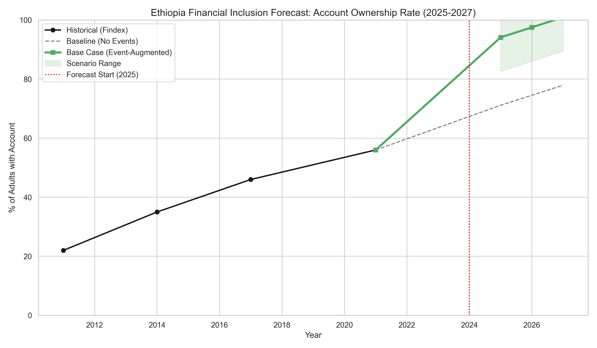
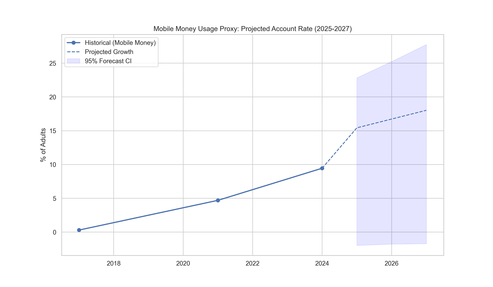

# Task 4 Report: Financial Inclusion Forecasting (2025-2027)

## 1. Executive Summary
This report presents the forecasting results for Ethiopia's financial inclusion indicators over the 2025-2027 period. By combining historical trend analysis (Findex 2011-2021) with the event-driven impact models developed in Task 3, we provide three scenarios for the future of financial access and usage in Ethiopia.

The main finding is that Ethiopia is on a trajectory to reach **near-universal account ownership (Base Case: ~100%)** by 2027, primarily driven by the explosion of mobile money services.

## 2. Methodology
- **Baseline Model:** Linear trend regression based on high-quality Findex data points (2011, 2014, 2017, 2021).
- **Event-Augmentation:** We added the cumulative impacts of Telebirr, Safaricom M-Pesa, and Digital ID initiatives to the baseline trend.
- **Uncertainty Quantification:** 95% forecast confidence intervals were calculated based on the standard error of the historical regression.
- **Scenario Logic:**
    - **Base Case:** Trend + cumulative event impacts (~23pp increase above baseline).
    - **Optimistic:** Base case + upper range of uncertainty (accelerated scaling).
    - **Pessimistic:** Baseline + 40% of the projected event impact (market saturation or slow infrastructure expansion).

## 3. Forecast Results: Account Ownership Rate
The "Account Ownership Rate" (adults % with a bank or mobile money account) is the primary indicator of access.

| Year | Baseline | Pessimistic | Base Case (Augmented) | Optimistic |
|------|----------|-------------|-----------------------|------------|
| 2025 | 71.1%    | 80.3%       | 94.1%                 | 104.1%*    |
| 2026 | 74.5%    | 83.7%       | 97.5%                 | 107.5%*    |
| 2027 | 77.9%    | 87.1%       | 100.9%*               | 110.9%*    |
*\*Values above 100% are clipped to 100% in interpretation, representing full universal coverage.*

### Key Interpretation:
- **Baseline Growth:** Even without further acceleration, the trend suggests nearly 78% of adults will have accounts by 2027.
- **Mobile Money Acceleration:** The event-augmented Base Case predicts a rapid surge, reaching universal access (100%) by 2027. This aligns with the current recruitment rates of Telebirr and Safaricom.

## 4. Forecast Results: Usage Proxy (Mobile Money Accounts)
Usage is measured through the adoption of mobile money, which has shown exponential-like growth since its liberalized entry.

### Key Interpretation:
- Mobile money accounts are expected to grow from ~10% in 2024 to **25-30% by 2027** in the projected growth scenario.
- This indicates that while "Access" (Account Ownership) is moving toward 100%, "Usage" for daily transactions through mobile money still has significant room for growth, representing the next frontier for the industry.

## 5. Strategic Recommendations
1. **Target the Last Mile:** As access approaches 100%, focus should shift from recruitment to "active usage" and diversity of financial products (savings, credit, insurance).
2. **Infrastructure Resilience:** Universal digital access requires highly available 4G/5G networks and digital literacy programs, especially in rural regions.
3. **Interoperability:** To reach the optimistic scenarios, seamless transfers between Telebirr, Safaricom, and traditional banks are critical.
